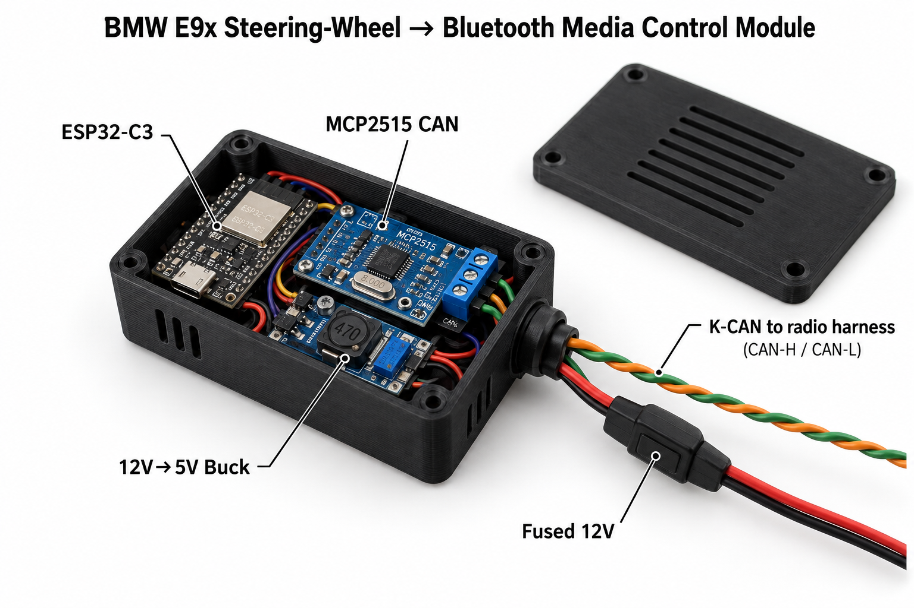

# e9x-kcan-media-control



Use the factory steering-wheel buttons of a BMW E9x (built for an E92) to
control music on the phone. An ESP32-C3 listens to the steering-wheel
message on K-CAN and sends Next / Previous / Play-Pause to the phone as
Bluetooth LE media keys. Music plays through an existing
Bluetooth-to-AUX receiver.

``` text
Steering-wheel buttons ─► K-CAN (0x1D6, 100 kbit/s) ─► MCP2515 ─SPI─► ESP32-C3
                                                                        │ BLE media keys
Phone ◄─────────────────────────────────────────────────────────────────┘
Phone ─A2DP─► Bluetooth-to-AUX receiver ─► AUX ─► car speakers
```

The phone pairs with two devices: the audio receiver and "BMW E92
Buttons". Volume stays with the factory radio.

## Hardware

-   ESP32-C3 dev board
-   MCP2515 CAN module (MCP2515 + TJA1050, 8 MHz crystal)
-   Buck converter 12 V → 5 V
-   Inline fuse 1–2 A on the 12 V input
-   Resistors 2.2 kΩ + 3.3 kΩ (level divider)

### Wiring

| From | To | Note |
|---|---|---|
| Car +12 V | Fuse 1–2 A → Buck IN+ | Switched 12 V from the radio harness avoids battery drain |
| Car GND | Buck IN− | |
| Buck 5 V | MCP2515 VCC, C3 `5V` | Buck 3.3 V output not used |
| Buck GND | MCP2515 GND, C3 GND | Common ground |
| C3 GPIO7 | MCP2515 CS | Direct |
| C3 GPIO4 | MCP2515 SCK | Direct |
| C3 GPIO6 | MCP2515 SI | Direct |
| MCP2515 SO | C3 GPIO5 via 2.2 kΩ | Plus 3.3 kΩ from GPIO5 to GND (5 V → 3.3 V divider) |
| MCP2515 INT | — | Not used |
| MCP2515 CANH | K-CAN high (green) | Behind the radio |
| MCP2515 CANL | K-CAN low (orange) | Behind the radio |

Notes:

-   Remove jumper **J1** (120 Ω terminator); the car bus is already
    terminated.
-   If the crystal is marked `16.000`, set `MCP2515_CRYSTAL_MHZ=16` in
    `platformio.ini`.
-   Leave the C3's USB-C port reachable from outside the enclosure for
    flashing and serial logs.

### Where to connect

K-CAN, 100 kbit/s, is reachable behind the radio: a twisted pair with
green = CAN-H and orange = CAN-L. The OBD port (pins 6/14) is D-CAN,
500 kbit/s, diagnostics only. The gateway most likely does not forward
0x1D6 there.

The firmware is always **listen-only**. It never transmits or ACKs on
the car bus.

## Firmware

PlatformIO project. Environments used for this build:

| Env | Purpose |
|---|---|
| `logger_esp32c3_mcp2515` | Listen-only CAN logger (test first) |
| `app_ble_esp32c3_mcp2515` | Steering wheel → BLE media keys |

``` powershell
pio run -e logger_esp32c3_mcp2515 -t upload
pio device monitor -e logger_esp32c3_mcp2515
```

Logger serial commands (type the letter in the monitor):

| Key | Action |
|---|---|
| `k` / `d` | Bitrate 100 kbit/s (K-CAN) / 500 kbit/s (D-CAN) |
| `a` | Print all frames |
| `c` | Print only frames whose payload changed (default) |
| `f` | Print only 0x1D6 |
| `m` | Print decoded button presses |
| `s` | Statistics and list of seen IDs |
| `h` | Help |

Other environments (not used in this build):

-   `*_esp32s3*` for ESP32-S3.
-   Without `_mcp2515`: the ESP32 built-in CAN controller (TWAI) with a
    3.3 V SN65HVD230 transceiver. C3/S3 pins: TX GPIO5, RX GPIO4.
-   `app_a2dp_esp32*` is for a classic ESP32 only (A2DP sink → PCM5102
    DAC → AUX, buttons via AVRCP). This is an all-in-one alternative to
    the external receiver. S3/C3 have no Bluetooth Classic and cannot
    receive phone audio.

### Button mapping

0x1D6 is 2 bytes, idle `C0 0C` (opendbc `BO_ 470 SteeringButtons`):

| Button | Byte | Mask | Frame | Action |
|---|---|---|---|---|
| Up | 0 | 0x20 | `E0 0C` | Next track |
| Down | 0 | 0x10 | `D0 0C` | Previous track |
| Vol + | 0 | 0x08 | `C8 0C` | (factory radio) |
| Vol − | 0 | 0x04 | `C4 0C` | (factory radio) |
| Telephone | 0 | 0x01 | `C1 0C` | Play/Pause |
| Voice | 1 | 0x01 | `C0 0D` | Play/Pause |

byte0 = `0xFF` is a fault frame and is ignored. Each physical press sends
one command. The table lives in `src/common/mfl.cpp`.

### Build setup (Windows)

GCC toolchains fail if the PlatformIO path contains non-ASCII characters
(e.g. a user name with `ç`, `ë`, `ü`). In that case, point PlatformIO at
an ASCII path. The easiest is the 8.3 short name of your profile folder:

``` powershell
# Get the ASCII short path of your profile, e.g. C:\Users\NAME~1
$short = cmd /c 'for %I in ("%USERPROFILE%") do @echo %~sI'
$core  = "$short\.platformio"

# Install PlatformIO into a venv inside it
py -m venv "$core\penv"
& "$core\penv\Scripts\python.exe" -m pip install platformio

# Make it permanent for your user (restart the terminal afterwards)
[Environment]::SetEnvironmentVariable('PLATFORMIO_CORE_DIR', $core, 'User')
$p = [Environment]::GetEnvironmentVariable('Path', 'User')
[Environment]::SetEnvironmentVariable('Path', "$p;$core\penv\Scripts", 'User')
```

If 8.3 names are disabled on the drive, use any ASCII folder instead,
e.g. `C:\pio`. With an ASCII user name, a normal `pip install platformio`
or the VS Code PlatformIO extension works without this.

## Next steps

1.  Wire C3 + MCP2515 and flash `logger_esp32c3_mcp2515`.
2.  Connect to K-CAN behind the radio, ignition on, confirm 0x1D6 frames.
3.  In `m` mode, press each button and verify the table above. Then type
    `s` and save the list of CAN IDs seen at the tap point (input for
    step 6).
4.  Flash `app_ble_esp32c3_mcp2515`. On the phone, open Bluetooth
    settings, pair "BMW E92 Buttons", and test.
5.  Build a small enclosure (PETG/ABS, not PLA) and mount it behind the
    radio. Optional: mount it in the armrest console instead, powered by
    a dual USB adapter in the armrest 12 V socket (shared with the
    Bluetooth-AUX receiver, no buck converter needed). This keeps the
    C3's USB-C port reachable for reflashing; run the twisted K-CAN pair
    (~1 m) from behind the radio.
6.  **Live dashboard over Wi-Fi.** The C3 runs a Wi-Fi hotspot and
    serves a web page, opened on the phone in its holder. Plan:
    -   Decode extra K-CAN values (to be confirmed with the logger):
        battery voltage `0x3B4`, coolant temp `0x1D0`, outside temp
        `0x2CA`, speed `0x1B4`, RPM `0x0AA`, fuel level `0x349`, range
        `0x366`.
    -   Page stored on the C3, live updates several times per second
        without reloading, dark theme, large numbers, landscape layout.
        Save to the home screen so it opens like an app.
    -   Access via the C3's own hotspot at a fixed address, e.g.
        `http://192.168.4.1` (on Android choose "stay connected" when
        warned about no internet). Alternative: the C3 joins the phone's
        personal hotspot, which keeps mobile data working.
    -   Wi-Fi and BLE share the C3's single radio; fine for button
        presses plus a dashboard.
7.  Wireless firmware updates (OTA) over the same Wi-Fi, so reflashing no
    longer needs USB.

## References

-   <https://github.com/dzid26/opendbc-BMW-E8x-E9x>: DBC
    (`opendbc/dbc/bmw_e9x_e8x.dbc`) with the 0x1D6 definition.
-   <https://github.com/BMW-E8x-E9x/BlueGenieBMW>: E9x, MCP2515 on K-CAN
    behind the radio, Bluetooth module controlled over UART.
-   <https://github.com/meyerdominik/ESP32_bluetoothmedia>: E87, classic
    ESP32 A2DP sink + PCM5102 + K-CAN. Confirms the button codes.
-   <https://github.com/llilakoblock/bmw-e87-e90-can-bt>: ESP32-S3 + BLE
    keyboard, plus an E9x CAN ID list.
-   <https://www.loopybunny.co.uk/CarPC/can/1D6.html>: 0x1D6 details.
